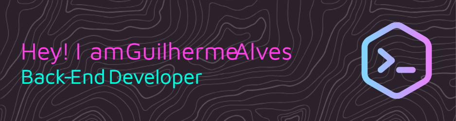

# 💫 About Me:
Hi! I'm Guilherme, a passionate Back-End Developer from Brazil, focused on building efficient and scalable web applications.  I have a strong interest in designing APIs and solving real-world problems through clean and maintainable code. My goal is to keep learning, growing, and contributing to impactful tech projects.  💻 What I enjoy working with:  Back-end technologies like Node.js, Golang, and Java  RESTful APIs, microservices, and clean architecture  Relational and NoSQL databases  Docker, Git, and CI/CD workflows  🌱 Currently improving my skills in Golang and exploring cloud technologies.  📚 Lifelong learner | Team player | Open to new challenges  Let’s connect and build something amazing together!

## 🌐 Socials:
     

# 💻 Tech Stack:
                
# 📊 GitHub Stats:
 
 

## 🏆 GitHub Trophies

### ✍️ Random Dev Quote

### 🔝 Top Contributed Repo

---

<!-- Proudly created with GPRM ( https://gprm.itsvg.in ) -->
